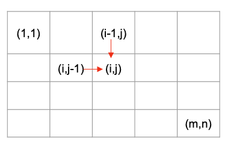

# Dynamic Programming

**Jiawei Wang (Angold-4)** 
**Based on Huifeng Guan's [Slides](https://docs.google.com/presentation/d/1F_Qp3kzw7jZkPpb7ll7J6-02285bCA3Z9nmU1e7a2rk/edit#slide=id.p) and [Video](https://www.youtube.com/watch?v=FLbqgyJ-70I)** 

## 0. Why Dynamic Programming?
**Defining an appropriate state can save a lot of repetitive search process** 

**`dp[i][j] = dp[i-1][j] + dp[i][j-1]`**
> **The past does not depend on the future, and the future does not affect the past !**

## 1. DP Basic i
Given a sequence (array/string), each element can be considered "one day", **and the state of "today" depends only on the state of "yesterday".**

* **[LC 198. House Robber (E)](HouseRobber.cpp)**
* **[LC 213. House Robber ii (E+)](HouseRobberii.cpp)**
* **[LC 121. Best Time to Buy and Sell Stock (E+)](BestTimeToBuyAndSellStock.cpp)**
* **[LC 123. Best Time to Buy and Sell Stock iii (M)](BestTimeToBuyAndSellStockiii.cpp)**
* **[LC 188. Best Time to Buy and Sell Stock iv (M+)](BestTimeToBuyAndSellStockiv.cpp)**
* **[LC 309. Best Time to Buy and Sell Stock with Cooldown (M)](BestTimeToBuyAndSellStockWithCooldown.cpp)**
* **[LC 2054. Two Best Non-Overlapping Events (H)](TwoBestNonOverlappingEvents.cpp)**
* **[CF 698A. Vacations (M)](https://github.com/Angorithm4/Angorithm4/blob/main/CodeForces/Vacations.cpp)**
* **[LC 376. Wiggle Subsequence (M)](WiggleSubsequence.cpp)**
* **[LC 276. Paint Fence (M+)](PaintFence.cpp)**
* **[LC 256. Paint House (E+)](PaintHouse.cpp)**
* **[LC 265. Paint House ii (M)](PaintHouseii.cpp)**
* **[LC 1186. Maximum Subarry Sum with One Delection (M)](MaximumSubaryyWithOneDelection.cpp)**
* **[LC 487. Max Consecutive Ones (M-)](MaxConsecutiveOne.cpp)**
* **[LC 931. Minimum Falling Path Sum (E)](MinimumFallingPathSum.cpp)**
* **[LC 1289. Minimum Falling Path Sum ii (M)](MinimumFallingPathSumii.cpp)**

